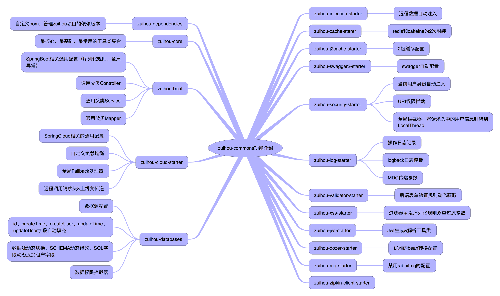

# zuihou-commons

## 简介
`zuihou-commons` 是 [zuihou-admin-cloud](https://gitee.com/zuihou111/zuihou-admin-cloud) 和 [zuihou-admin-boot](https://gitee.com/zuihou111/zuihou-admin-boot) 项目的核心工具包，开发宗旨是打造一套兼顾 SpringBoot 和 SpringCloud 项目的公共工具类。

## 项目组成及项目名由来
本项目由`zuihou-admin-cloud`、`zuihou-admin-boot`、`zuihou-commons`、`zuihou-ui`、`zuihou-admin-ui`、`zuihou-generator` 等6个项目组成，其中：
- zuihou-commons：是项目的核心工具包，开发宗旨是打造一套按模块独立使用的工具类。 （cloud、boot项目必须先编译它）
- zuihou-admin-cloud：是基于SpringCloud的SaaS型微服务快速开发平台
- zuihou-admin-boot： 是基于SpringBoot的SaaS型单体架构快速开发平台，功能和zuihou-admin-cloud完全一致
- zuihou-generator：  是基于`mybatis-plus-generator`定制的代码生成器，专门按 zuihou-admin-cloud 和 zuihou-admin-boot 项目的结构生成Controller、Service、Dao、Entity、DTO、XML、前端Vue页面等代码。生成代码后，能实现不写一行代码、不移动一个类，即拥有CRUD、导入、导出等功能。
- zuihou-ui： 给客户使用的后台系统
- zuihou-admin-ui： 公司内部管理人员使用的后台管理系统，用于管理租户信息。

项目名解释：
- zuihou：即中文名：最后，是十多年来在各大平台一直使用的网名
- admin： 最初的设想是做一个后台管理系统
- cloud： 基于SpringCloud框架
- boot：  基于SpringBoot框架
- commons： 公共的组件、工具类
- generator： 代码生成
- ui：前端项目

## 结构介绍

## 主要功能
- Mvc封装： 通用的 Controller、Service、Mapper、全局异常、全局序列化、反序列化规则
- SpringCloud封装：请求头传递、调用日志、灰度、统一配置编码解码规则等
- 关联数据注入：优雅解决 跨库表关联字段回显、跨服务字段回显
- 持久层增强：增强MybatisPlus Wrapper操作类、数据权限
- 枚举、字典等字段统一传参、回显格式： 解决前端即要使用编码，有要回显中文名的场景。
- 在线文档：对swagger、knife4j二次封装，实现配置即文档。
- 前后端表单统一校验：还在为前端写一次校验规则，后端写一次校验规则而痛苦不堪？ 本组件将后端配置的jsr校验规则返回给前端，前端通过全局js，实现统一的校验规则。
- 缓存：封装redis缓存、二级缓存等，实现动态启用/禁用redis
- XSS： 对表单参数、json参数进行xss处理
- 统一的操作日志： AOP方式记录操作日志
- 接口权限
- 快去看源码和文档，发现更多功能吧

如果觉得对您有任何一点帮助，请点右上角 "Star" 支持一下吧，谢谢！

[点我查看详细文档](https://www.kancloud.cn/zuihou/zuihou-admin-cloud) 

    ps: gitee捐献 或者 二维码打赏（本页最下方）： 45元及以上 并 备注邮箱，可得开发文档一份（支持后续更新）
    打赏或者捐献后直接加群：1039545140 并备注打赏时填写的邮箱，可以持续的获取最新的文档。 

## 会员版
本项目分为开源版和会员版，github和gitee上能搜索到的为开源版本，遵循Apache协议。 会员版源码在私有gitlab托管，购买后开通账号。

会员版和开源版区别请看：[会员版](会员版.md)

## 项目代码地址

| 项目 | gitee | github | 备注 |
|---|---|---|---|
| zuihou-commons | https://gitee.com/zuihou111/zuihou-commons  | https://github.com/zuihou/zuihou-commons | 核心工具类：boot和cloud 项目的公共抽象 |
| zuihou-admin-cloud | https://gitee.com/zuihou111/zuihou-admin-cloud | https://github.com/zuihou/zuihou-admin-cloud | 微服务项目 |
| zuihou-admin-boot | https://gitee.com/zuihou111/zuihou-admin-boot | https://github.com/zuihou/zuihou-admin-boot | 单体项目：功能跟cloud版一样 |
| zuihou-ui | https://gitee.com/zuihou111/zuihou-ui | https://github.com/zuihou/zuihou-ui | 租户后台：租户使用 |
| zuihou-admin-ui | https://gitee.com/zuihou111/zuihou-admin-ui | https://github.com/zuihou/zuihou-admin-ui | 开发&运营后台：内部使用 |
| zuihou-generator  | https://gitee.com/zuihou111/zuihou-generator | https://github.com/zuihou/zuihou-generator | 代码生成器：开发使用 |

## zuihou-admin-cloud 演示地址 （服务器没法备案，只能加上端口~~~）

| 项目 | 演示地址 | 管理员账号 | 普通账号 | 
|---|---|---|---|
| 租户后台 | http://tangyh.top:10000/zuihou-ui/ | zuihou/zuihou | test/zuiou |
| 开发&运营后台 | http://tangyh.top:180/zuihou-admin-ui/ | demoAdmin/zuihou | 无 |

## 友情链接 & 特别鸣谢
* SaaS型微服务快速开发平台：[https://github.com/zuihou/zuihou-admin-cloud](https://github.com/zuihou/zuihou-admin-cloud)
* SaaS型单体快速开发平台：[https://github.com/zuihou/zuihou-admin-boot](https://github.com/zuihou/zuihou-admin-boot)
* MyBatis-Plus：[https://mybatis.plus/](https://mybatis.plus/)
* knife4j：[http://doc.xiaominfo.com/](http://doc.xiaominfo.com/)
* hutool：[https://hutool.cn/](https://hutool.cn/)
* xxl-job：[http://www.xuxueli.com/xxl-job/](http://www.xuxueli.com/xxl-job/)
* kkfileview：[https://kkfileview.keking.cn](https://kkfileview.keking.cn)
* j2cache：[https://gitee.com/ld/J2Cache](https://gitee.com/ld/J2Cache)
* FEBS Cloud Web： [https://gitee.com/mrbirdd/FEBS-Cloud-Web](https://gitee.com/mrbirdd/FEBS-Cloud-Web)
    zuihou-ui 和 zuihou-admin-ui 基于本项目改造
* Cloud-Platform： [https://gitee.com/geek_qi/cloud-platform](https://gitee.com/geek_qi/cloud-platform)
    作者学习时接触到的第一个微服务项目
