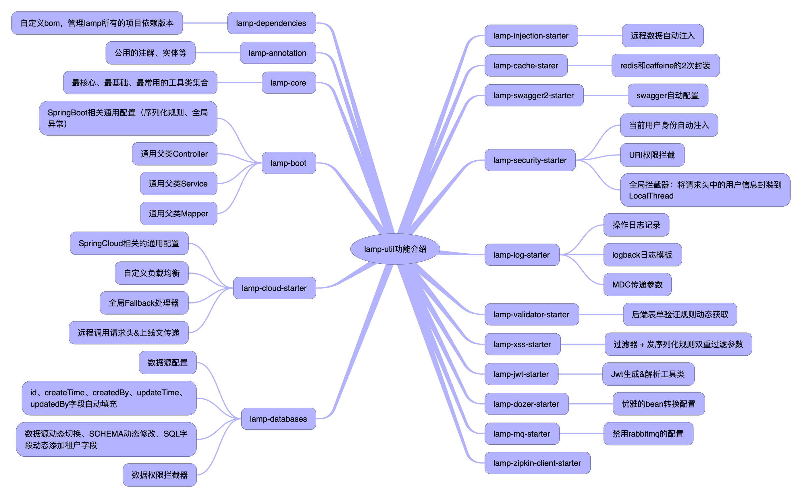

# lamp 快速开发平台

# lamp 项目名字由来

## 叙事版：

在一个夜黑风高的晚上，小孩吵着要出去玩，于是和`程序员老婆`一起带小孩出去放风，路上顺便讨论起项目要换个什么名字，在各自想出的名字都被对方一一否决后，大家陷入了沉思。 走着走着，在一盏路灯下，小孩指着前方的路灯打破宁静，喊出：灯灯～
我和媳妇相视一笑，然后一起说：哈哈，就用这个名字！！！

## 解释版：

`灯灯`： 灯灯象征着光明，给困境的我们带来希望，给加班夜归的程序员们照亮回家的路！

`灯灯`(简称灯， 英文名：lamp)，他是一个项目的统称，由"工具集"、"后端"、"前端"组成，包含以下几个子项目

> 如果你非要说lamp是Linux+Apache+MySQL+PHP，那就算是吧，毕竟PHP是世界上最好的语言，我也希望此项目成为世界上最好的后台框架！😈😈😈

## 工具集

| 项目 | gitee | github | 备注 |
| --- | --- | --- | --- |
| lamp-util | [lamp-util](https://gitee.com/zuihou111/lamp-util) | [lamp-util](https://github.com/zuihou/lamp-util) | 核心工具集 |
| lamp-generator | [lamp-generator](https://gitee.com/zuihou111/lamp-generator) | [lamp-generator](https://github.com/zuihou/lamp-generator) | 代码生成器 |
| lamp-job | [lamp-job](https://gitee.com/zuihou111/lamp-job) | [lamp-job](https://github.com/zuihou/lamp-job) | 分布式定时调度器 |

## 后端

| 项目 | gitee | github | 备注 |
| --- | --- | --- | --- |
| lamp-cloud | [lamp-cloud](https://gitee.com/dromara/lamp-cloud) |  [lamp-cloud](https://github.com/dromara/lamp-cloud) | SpringCloud(微服务)版 |
| lamp-boot | [lamp-boot](https://gitee.com/zuihou111/lamp-boot) |  [lamp-boot](https://github.com/zuihou/lamp-boot) | SpringBoot(单体)版 |
| 微服务版示例 | [lamp-samples](https://github.com/zuihou/lamp-samples) | [lamp-samples](https://github.com/zuihou/lamp-samples) | 常用示例 |

## 前端

| 项目 | gitee | github | 备注 | 演示地址 |
| --- | --- | --- | --- | --- |
| lamp-web | [lamp-web](https://gitee.com/zuihou111/lamp-web) | [lamp-web](https://github.com/zuihou/lamp-web) | 基于 vue-admin-element (element-ui) | https://pro.tangyh.top |
| lamp-web-plus(强烈推荐！👏👏👏) | [lamp-web-plus](https://gitee.com/zuihou111/lamp-web-plus) | [lamp-web-plus](https://github.com/zuihou/lamp-web-plus) | 基于 vue-vben-admin （vue 3 + ant design vue 2） | https://pro.tangyh.top/lamp-web |

## 区别及注意事项

### lamp-cloud和lamp-boot区别

- 功能完全一致，结构基本一致，前者基于SpringCloud实现，否则基于SpringBoot实现。 使用时，请任选其一，请不要在同一个IDE的工作空间同时导入 lamp-cloud 和 lamp-boot 项目！！！
- lamp-cloud和lamp-boot都依赖于lamp-util项目，请一定要先编译lamp-util项目，然后在编译 lamp-cloud 或者 lamp-boot。

### lamp-web、lamp-web-plus区别

- lamp-web基于vue-admin-element (vue2、element-ui) 二次开发。已基本完成，后续只会修复bug。
- lamp-web-plus基于 vue-vben-admin（vue3.x、 vite2.x、ant-design-vue2.x、vuex4.x、vue-router4.x 、echarts5.x）二次开发。近期的重点开发项目！！！

> 想要本地快速部署项目，体验效果只需下载lamp-util、lamp-cloud/lamp-boot(任选其一)、lamp-web/lamp-web-plus(任选其一) 3个项目，并按照 [文档](https://www.kancloud.cn/zuihou/zuihou-admin-cloud) 配置并启动即可。

# lamp-util 简介

`lamp-util` 的前身是 `zuihou-commons`，在3.0.0版本之后，改名为lamp-util，它是`lamp`
项目的核心工具类，lamp-cloud和lamp-boot都依赖它，请先编译lamp-util，在编译lamp-cloud或lamp-boot。
`lamp-util` 是基于`jdk11/jdk8`的， [lamp-cloud](https://github.com/dromara/lamp-cloud)
和 [lamp-boot](https://github.com/zuihou/lamp-boot) 项目的核心工具包， 开发宗旨是打造一套兼顾 SpringBoot 和 SpringCloud 项目的与业务无关的工具类。

她具备SaaS模式切换、完备的RBAC功能、网关统一鉴权、灰度发布、数据权限、可插拔缓存、统一封装缓存的key、表单校验前后端统一验证、字典数据自动回显、Xss防跨站攻击、自动生成前后端代码、多种存储系统、分布式事务、分布式定时任务等多个功能和模块，
支持多业务系统并行开发， 支持多服务并行开发，是中后台系统开发脚手架的最佳选择。代码简洁，注释齐全，架构清晰，非常适合学习和企业作为基础框架使用。

# lamp 租户模式介绍

本项目可以通过配置，无缝切换项目的 **租户模式**。

| 租户模式 | 描述 | 优点 | 缺点  |
|---|---|---|---|
| NONE(非租户模式) | 没有租户 | 简单、适合独立系统 | 缺少租户系统的优点 |
| COLUMN(字段模式) | 租户共用一个数据库，在业务表中增加字段来区分 | 简单、不复杂、开发无感知 | 数据隔离性差、安全性差、数据备份和恢复困难、 |
| SCHEMA(独立schema) | 每个租户独立一个 数据库(schema)，执行sql时，动态在表名前增加schema | 简单、开发无感知、数据隔离性好 | 配置文件中必须配置数据库的root账号、不支持复杂sql和 sql嵌套自定义函数 |
| DATASOURCE(独立数据源) | 每个租户独立一个 数据库(数据源)，执行代码时，动态切换数据源 | 可独立部署数据库，数据隔离性好、扩展性高、故障影响小 | 相对复杂、开发需要注意切换数据源时的事务问题、需要较多的数据库 |

# 会员版演示地址
- 后端使用lamp-cloud-plus，前端使用lamp-web-plus。演示地址： https://pro.tangyh.top
- 后端使用lamp-cloud-plus，前端使用lamp-web。演示地址： https://pro.tangyh.top/lamp-web
- 后端使用lamp-boot-plus， 前端使用lamp-web-plus。演示地址： https://boot.tangyh.top
- 后端使用lamp-boot-plus， 前端使用lamp-web。演示地址： https://boot.tangyh.top/lamp-web

# 演示账号
- 以下内置账号仅限于内置的0000租户
- 平台管理员： lamp_pt/lamp (内置给公司内部运营人员使用)
- 超级管理员： lamp/lamp
- 普通管理员： general/lamp
- 普通账号： normal/lamp

> ps: 演示环境中内置租户没有写入权限，若要在演示环境测试增删改，请使用lamp_pt账号查询租户管理员账号后,登录新租户测试

## 结构介绍

## lamp-util 亮点功能

- Mvc封装： 通用的 Controller、Service、Mapper、全局异常、全局序列化、反序列化规则
- SpringCloud封装：请求头传递、调用日志、灰度、统一配置编码解码规则等
- 数据回显：优雅解决 跨库表关联字段回显、跨服务字段回显
- 持久层增强：增强MybatisPlus Wrapper操作类、数据权限、自定义类型处理器
- 枚举、字典等字段统一传参、回显格式： 解决前端即要使用编码，有要回显中文名的场景。
- 在线文档：对swagger、knife4j二次封装，实现配置即文档。
- 前后端表单统一校验：还在为前端写一次校验规则，后端写一次校验规则而痛苦不堪？ 本组件将后端配置的jsr校验规则返回给前端，前端通过全局js，实现统一的校验规则。
- 缓存：封装redis缓存、二级缓存等，实现动态启用/禁用redis
- XSS： 对表单参数、json参数进行xss处理
- 统一的操作日志： AOP方式优雅记录操作日志
- 轻量级接口权限
- 快去看源码和文档发现 [更多功能](https://www.kancloud.cn/zuihou/zuihou-admin-cloud) 吧

# lamp-cloud 技术栈/版本介绍：

- 所涉及的相关的技术有：
    - JSON序列化:Jackson
    - 消息队列：RabbitMQ
    - 缓存：Redis
    - 数据库： MySQL 5.7.9 或者 MySQL 8.0.19
    - 定时器：采用xxl-job项目进行二次改造
    - 前端：vue2 + element-ui 或者 vue3 + ant design vue
    - 持久层框架： Mybatis-plus
    - 代码生成器：基于Mybatis-plus-generator自定义
    - API网关：Gateway
    - 服务注册&发现和配置中心: Nacos
    - 服务消费：OpenFeign
    - 负载均衡：Ribbon
    - 服务熔断：Sentinel
    - 项目构建：Maven
    - 分布式事务： seata
    - 分布式系统的流量防卫兵： Sentinel
    - 监控： spring-boot-admin
    - 链路调用跟踪： SkyWalking
    - 文件服务器：FastDFS/阿里云OSS/本地存储/MinIO/华为云OBS/七牛云OSS
    - Nginx
- 部署方面：
    - 服务器：CentOS
    - Jenkins
    - Docker
    - Kubernetes
    
# 交流群，加群前请先给项目点个 "Star"，谢谢！😘

- 63202894(主群满员，请加群2)
- 1011148503(群2)

## 如果觉得本项目对您有任何一点帮助，请点右上角 "Star" 支持一下， 并向您的基友、同事们宣传一下吧，谢谢！

## [点我详细查看如何使用本项目的高级功能](https://www.kancloud.cn/zuihou/zuihou-admin-cloud)

    ps: gitee捐献 或者 二维码打赏(本页最下方)： 45元及以上 并 备注邮箱，可得"离线开发文档"一份，支持后续文档更新 
        打赏或者捐献后直接加群：1039545140 并备注打赏时填写的邮箱，本群仅用于持续的获取最新的"离线开发文档"。 
        "离线开发文档"和看云上的"在线文档"内容一样，在看云在线购买的不用申请入群，看云购买的可以申请上面的交流群。

## 发现bug请提交 [issues](https://github.com/dromara/lamp-cloud/issues)

## 使用项目遇到问题请先查看历史 [discussions](https://github.com/dromara/lamp-cloud/discussions) ，未找到解决方案，在提交discussions(问题描述详细一些，报错截图大一些，复现步骤全一些)

# 会员版

本项目分为开源版和会员版，github和gitee上能搜索到的为开源版本，遵循Apache协议。 会员版源码在私有gitlab托管，购买后开通账号。

会员版和开源版区别请看：[会员版](https://www.kancloud.cn/zuihou/zuihou-admin-cloud/2074547)

# 友情链接 & 特别鸣谢

* 微服务快速开发平台：[https://github.com/dromara/lamp-cloud](https://github.com/dromara/lamp-cloud)
* 单体快速开发平台：[https://github.com/zuihou/lamp-boot](https://github.com/zuihou/lamp-boot)
* MyBatis-Plus：[https://mybatis.plus/](https://mybatis.plus/)
* knife4j：[http://doc.xiaominfo.com/](http://doc.xiaominfo.com/)
* hutool：[https://hutool.cn/](https://hutool.cn/)
* xxl-job：[http://www.xuxueli.com/xxl-job/](http://www.xuxueli.com/xxl-job/)
* kkfileview：[https://kkfileview.keking.cn](https://kkfileview.keking.cn)
* vue-vben-admin(vue3.x + vite2.x)： [https://github.com/anncwb/vue-vben-admin](https://github.com/anncwb/vue-vben-admin)

  lamp-web-plus 基于本项目改造

* FEBS Cloud Web： [https://gitee.com/mrbirdd/FEBS-Cloud-Web](https://gitee.com/mrbirdd/FEBS-Cloud-Web)

  lamp-web 基于本项目改造， 感谢 [wuyouzhuguli](https://github.com/wuyouzhuguli)

* Cloud-Platform： [https://gitee.com/geek_qi/cloud-platform](https://gitee.com/geek_qi/cloud-platform)

  作者学习时接触到的第一个微服务项目
